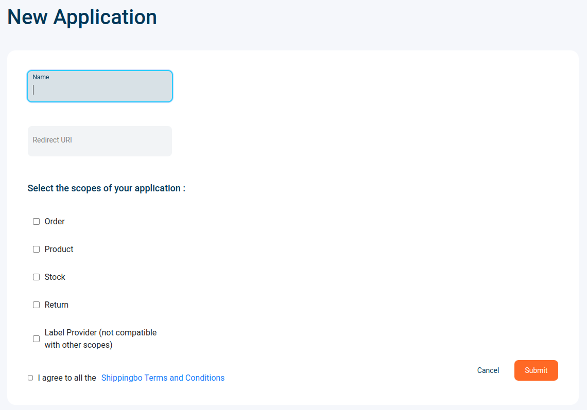

# Create a Shippingbo application

If you want to create a Shippingbo Application you must create a developer account on the [Developer Dashboard](https://dev.shippingbo.com)

Shippingbo Apps allows you to manage several Shippingbo accounts. It's the best solution if you want to develop an extension, plugin or connect your services to Shippingbo. Some application can be `verified` and added to the Shippingbo Ecosytem page

## Create the App

Once you have created your developer account, click on `New application` button

Then, enter the name of your app, your redirect URI, select scopes according to your needed and check the Terms and Conditions

The redirect URI, is the location to which the authorization server sends the user once the application has been authorized and an authorization code. The authorization server sends the code or token to the redirect URI, so it's important that you record the correct location as part of the application registration process.

It must be in https://... format. If you want to send the token in the headers, you can use the following url: urn:ietf:wg:oauth:2.0:oob, that can be useful for testing and avoid redirection

Submit the form

Next article: [Refresh the access token](https://developer.shippingbo.com/docs/api/eq2qnbmjnwg4y-authentication-with-oauth)
