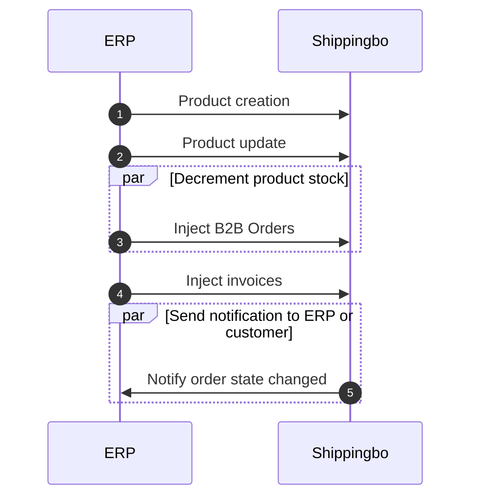
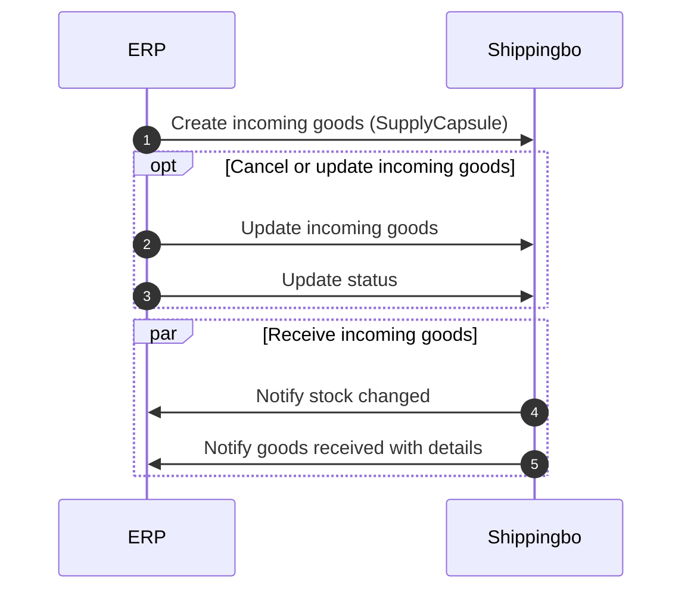

# Connect an ERP

To connect an ERP we recommend to follow those steps:

- Follow the tutorial to [connect an order source](https://developer.shippingbo.com/docs/api/branches/main/wmyaww0hkv422-connect-an-order-source)
- [Join an invoice to an Order](https://developer.shippingbo.com/docs/api/branches/main/1c2c1a2a5fd05-join-an-invoice-to-an-order) (only if you want to inject invoices in Shippingbo)
- [Manage incoming goods](https://developer.shippingbo.com/docs/api/branches/main/yyk111bjoc3h8-manage-incoming-goods)

## Order sequence diagram

See [B2C workflow](https://developer.shippingbo.com/docs/api/wmyaww0hkv422-connect-an-order-source)

## Incoming goods sequence diagram

