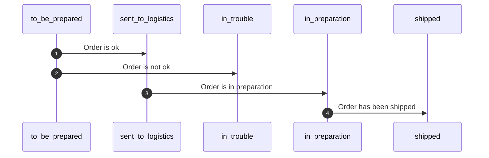

# Manage orders

## Retrieve to be prepared orders

### Webhooks (recommend)

We recommend to use [Webhooks](https://developer.shippingbo.com/docs/api/6fkoxdhf5024p-how-to-configure) on object `Order` to notify your system that is a new `Order` created or updated

<!-- theme: warning -->
> We recommend to create webhooks on `Order` for:
>- **state** with value: *to_be_prepared*
>- **state** with value: *canceled*
>- **relay_ref** field. Some Marketplace or CMS can update the field after the `Order` creation, in particular Shopify modules

### With a GET request

The next request will return a collection of *to_be_prepared* orders that you have to save in your system

```curl
curl --request GET \
  --url https://app.shippingbo.com/orders?search[state]=to_be_prepared \
  --header 'Content-Type: application/json' \
  --header 'X-API-TOKEN: ' \
  --header 'X-API-USER: ' \
  --header 'X-API-USER-ID: ' \
  --header 'X-API-VERSION: '
```
```php
<?php

$curl = curl_init();

curl_setopt_array($curl, [
  CURLOPT_URL => "https://app.shippingbo.com/orders?search[state]=to_be_prepared",
  CURLOPT_RETURNTRANSFER => true,
  CURLOPT_ENCODING => "",
  CURLOPT_MAXREDIRS => 10,
  CURLOPT_TIMEOUT => 30,
  CURLOPT_HTTP_VERSION => CURL_HTTP_VERSION_1_1,
  CURLOPT_CUSTOMREQUEST => "GET",
  CURLOPT_HTTPHEADER => [
    "Content-Type: application/json",
    "X-API-TOKEN: ",
    "X-API-USER: ",
    "X-API-USER-ID: ",
    "X-API-VERSION: "
  ],
]);

$response = curl_exec($curl);
$err = curl_error($curl);

curl_close($curl);

if ($err) {
  echo "cURL Error #:" . $err;
} else {
  echo $response;
}
```
```ruby
require 'uri'
require 'net/http'
require 'openssl'

url = URI("https://app.shippingbo.com/orders?search[state]=to_be_prepared")

http = Net::HTTP.new(url.host, url.port)
http.use_ssl = true
http.verify_mode = OpenSSL::SSL::VERIFY_NONE

request = Net::HTTP::Get.new(url)
request["Content-Type"] = 'application/json'
request["X-API-TOKEN"] = ''
request["X-API-USER"] = ''
request["X-API-VERSION"] = ''
request["X-API-USER-ID"] = ''

response = http.request(request)
puts response.read_body
```

> The request is made on the secondary, it can be a latency between the update of the order and the result of this request

## Order lifecycle



### Confirm order reception

You have to update the status of the `Order` to `sent_to_logistics` to indicate that the `Order` has been integrate in your system. The merchant can be sure the `Order` will be treated

You must use the endpoint [Update an Order](https://developer.shippingbo.com/docs/api/f321a1d62fac6-update-an-order)

```curl
curl --request PATCH \
  --url https://app.shippingbo.com/order/orderId \
  --header 'Content-Type: application/json' \
  --header 'X-API-TOKEN: ' \
  --header 'X-API-USER: ' \
  --header 'X-API-USER-ID: ' \
  --header 'X-API-VERSION: ' \
  --data '{
  "state": "sent_to_logistics"
}'
```
```php
<?php

$curl = curl_init();

curl_setopt_array($curl, [
  CURLOPT_URL => "https://app.shippingbo.com/order/orderId",
  CURLOPT_RETURNTRANSFER => true,
  CURLOPT_ENCODING => "",
  CURLOPT_MAXREDIRS => 10,
  CURLOPT_TIMEOUT => 30,
  CURLOPT_HTTP_VERSION => CURL_HTTP_VERSION_1_1,
  CURLOPT_CUSTOMREQUEST => "PATCH",
  CURLOPT_POSTFIELDS => "{\n  \"state\": \"sent_to_logistics\"\n}",
  CURLOPT_HTTPHEADER => [
    "Content-Type: application/json",
    "X-API-TOKEN: ",
    "X-API-USER: ",
    "X-API-USER-ID: ",
    "X-API-VERSION: "
  ],
]);

$response = curl_exec($curl);
$err = curl_error($curl);

curl_close($curl);

if ($err) {
  echo "cURL Error #:" . $err;
} else {
  echo $response;
}
```
```ruby
require 'uri'
require 'net/http'
require 'openssl'

url = URI("https://app.shippingbo.com/order/orderId")

http = Net::HTTP.new(url.host, url.port)
http.use_ssl = true
http.verify_mode = OpenSSL::SSL::VERIFY_NONE

request = Net::HTTP::Patch.new(url)
request["Content-Type"] = 'application/json'
request["X-API-USER"] = ''
request["X-API-TOKEN"] = ''
request["X-API-VERSION"] = ''
request["X-API-USER-ID"] = ''
request.body = "{\n  \"state\": \"sent_to_logistics\"\n}"

response = http.request(request)
puts response.read_body
```

### Order in preparation (optionnal)

You can indicate that the order is in `preparation` by updating the state to `in_preparation` with a similar request

```curl
curl --request PATCH \
  --url https://app.shippingbo.com/order/orderId \
  --header 'Content-Type: application/json' \
  --header 'X-API-TOKEN: ' \
  --header 'X-API-USER: ' \
  --header 'X-API-USER-ID: ' \
  --header 'X-API-VERSION: ' \
  --data '{
  "state": "in_preparation"
}'
```
```php
<?php

$curl = curl_init();

curl_setopt_array($curl, [
  CURLOPT_URL => "https://app.shippingbo.com/order/orderId",
  CURLOPT_RETURNTRANSFER => true,
  CURLOPT_ENCODING => "",
  CURLOPT_MAXREDIRS => 10,
  CURLOPT_TIMEOUT => 30,
  CURLOPT_HTTP_VERSION => CURL_HTTP_VERSION_1_1,
  CURLOPT_CUSTOMREQUEST => "PATCH",
  CURLOPT_POSTFIELDS => "{\n  \"state\": \"in_preparation\"\n}",
  CURLOPT_HTTPHEADER => [
    "Content-Type: application/json",
    "X-API-TOKEN: ",
    "X-API-USER: ",
    "X-API-USER-ID: ",
    "X-API-VERSION: "
  ],
]);

$response = curl_exec($curl);
$err = curl_error($curl);

curl_close($curl);

if ($err) {
  echo "cURL Error #:" . $err;
} else {
  echo $response;
}
```
```ruby
require 'uri'
require 'net/http'
require 'openssl'

url = URI("https://app.shippingbo.com/order/orderId")

http = Net::HTTP.new(url.host, url.port)
http.use_ssl = true
http.verify_mode = OpenSSL::SSL::VERIFY_NONE

request = Net::HTTP::Patch.new(url)
request["Content-Type"] = 'application/json'
request["X-API-USER"] = ''
request["X-API-TOKEN"] = ''
request["X-API-VERSION"] = ''
request["X-API-USER-ID"] = ''
request.body = "{\n  \"state\": \"in_preparation\"\n}"

response = http.request(request)
puts response.read_body
```

### Not shippable orders

If the order cannot be shipped you must update the state to `in_trouble` to warn the merchant that the order will be not treated by the WMS

We recommend to add a message after the update by using the [Create OrderEvent](https://developer.shippingbo.com/docs/api/5099cf16e6539-create-an-order-event) endpoint

```curl
curl --request POST \
  --url https://app.shippingbo.com/order_events \
  --header 'Content-Type: application/json' \
  --header 'X-API-TOKEN: ' \
  --header 'X-API-USER: ' \
  --header 'X-API-USER-ID: ' \
  --header 'X-API-VERSION: ' \
  --data '{
  "order_id": 1234,
  "level": "error",
  "title": "....",
  "message": "...."
}'
```

```php
<?php

$curl = curl_init();

curl_setopt_array($curl, [
  CURLOPT_URL => "https://app.shippingbo.com/order_events",
  CURLOPT_RETURNTRANSFER => true,
  CURLOPT_ENCODING => "",
  CURLOPT_MAXREDIRS => 10,
  CURLOPT_TIMEOUT => 30,
  CURLOPT_HTTP_VERSION => CURL_HTTP_VERSION_1_1,
  CURLOPT_CUSTOMREQUEST => "POST",
  CURLOPT_POSTFIELDS => "{\n  \"order_id\": 1234,\n  \"level\": \"error\",\n  \"title\": \"....\",\n  \"message\": \"....\"\n}",
  CURLOPT_HTTPHEADER => [
    "Content-Type: application/json",
    "X-API-TOKEN: ",
    "X-API-USER: ",
    "X-API-USER-ID: ",
    "X-API-VERSION: "
  ],
]);

$response = curl_exec($curl);
$err = curl_error($curl);

curl_close($curl);

if ($err) {
  echo "cURL Error #:" . $err;
} else {
  echo $response;
}
```
```ruby
require 'uri'
require 'net/http'
require 'openssl'

url = URI("https://app.shippingbo.com/order_events")

http = Net::HTTP.new(url.host, url.port)
http.use_ssl = true
http.verify_mode = OpenSSL::SSL::VERIFY_NONE

request = Net::HTTP::Post.new(url)
request["Content-Type"] = 'application/json'
request.body = "{\n  \"order_id\": 1234,\n  \"level\": \"error\",\n  \"title\": \"....\",\n  \"message\": \"....\"\n}"

response = http.request(request)
puts response.read_body
```
## Retrieve the computed shipping service (optionnal)

Shippingbo is able to compute the right shipping service to use to ship the `Order`, you have to call the [Retrieve computed Logistician Shipping Service Enpoint](https://developer.shippingbo.com/docs/api/branches/main/c762725c90a27-retrieve-computed-logistician-shipping-service)

```curl
curl --request GET \
  --url https://app.shippingbo.com/logistician_service_configs/matching_service/PredefinedLogistician::GenericLogistician/of/orderId \
  --header 'Content-Type: application/json' \
  --header 'X-API-TOKEN: ' \
  --header 'X-API-USER: ' \
  --header 'X-API-USER-ID: ' \
  --header 'X-API-VERSION: '
```
```php
<?php

$curl = curl_init();

curl_setopt_array($curl, [
  CURLOPT_URL => "https://app.shippingbo.com/logistician_service_configs/matching_service/PredefinedLogistician::GenericLogistician/of/orderId",
  CURLOPT_RETURNTRANSFER => true,
  CURLOPT_ENCODING => "",
  CURLOPT_MAXREDIRS => 10,
  CURLOPT_TIMEOUT => 30,
  CURLOPT_HTTP_VERSION => CURL_HTTP_VERSION_1_1,
  CURLOPT_CUSTOMREQUEST => "GET",
  CURLOPT_HTTPHEADER => [
    "Content-Type: application/json",
    "X-API-TOKEN: ",
    "X-API-USER: ",
    "X-API-USER-ID: ",
    "X-API-VERSION: "
  ],
]);

$response = curl_exec($curl);
$err = curl_error($curl);

curl_close($curl);

if ($err) {
  echo "cURL Error #:" . $err;
} else {
  echo $response;
}
```
```ruby
require 'uri'
require 'net/http'
require 'openssl'

url = URI("https://app.shippingbo.com/logistician_service_configs/matching_service/PredefinedLogistician::GenericLogistician/of/orderId")

http = Net::HTTP.new(url.host, url.port)
http.use_ssl = true
http.verify_mode = OpenSSL::SSL::VERIFY_NONE

request = Net::HTTP::Get.new(url)
request["Content-Type"] = 'application/json'
request["X-API-TOKEN"] = ''
request["X-API-USER"] = ''
request["X-API-VERSION"] = ''
request["X-API-USER-ID"] = ''

response = http.request(request)
puts response.read_body
```
```json
{
  "logistician_service_config": {
    "id": 0,
    "created_at": "2019-08-24T14:15:22Z",
    "updated_at": "2019-08-24T14:15:22Z",
    "predefined_logistician_id": 0,
    "name": "string",
    "config": {
      "service_code": "string",
      "shipping_options": "string",
      "tags_to_send": "string"
    }
  }
}
```