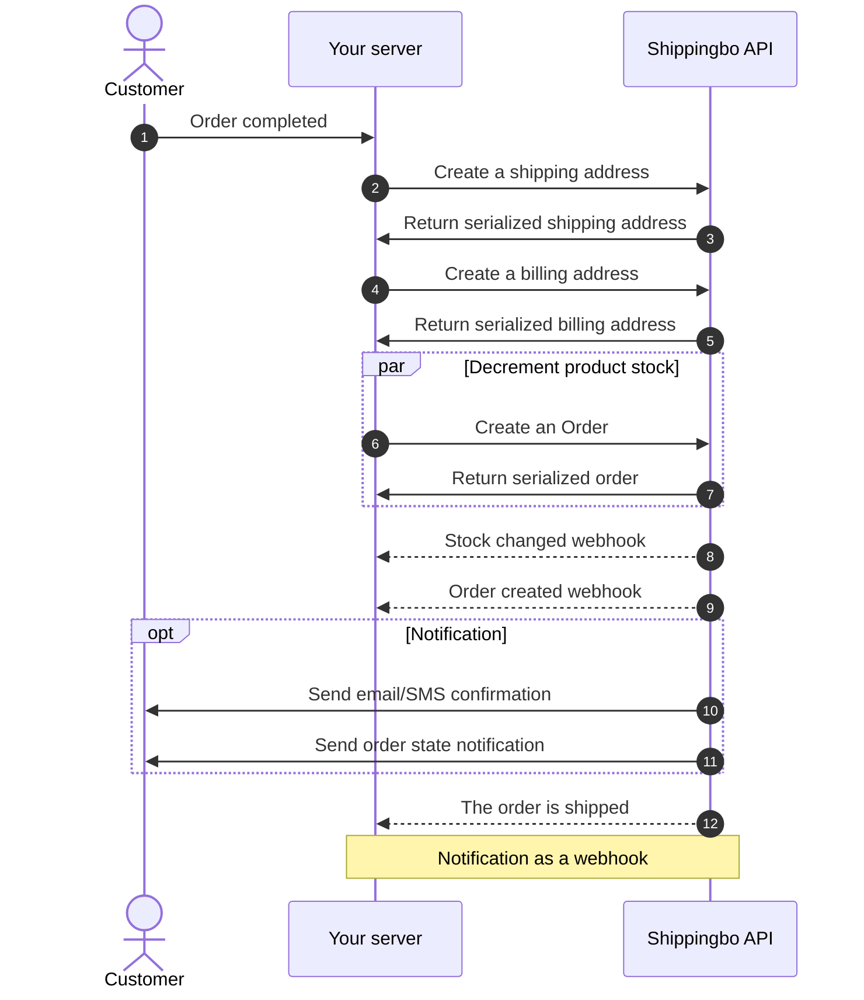

# Connect an order source

To connect an order source we recommend to follow those steps:

- [Create your first order](https://developer.shippingbo.com/docs/api/branches/main/c3fa417ce0854-create-your-first-order)
- [Join an invoice to an Order](https://developer.shippingbo.com/docs/api/branches/main/1c2c1a2a5fd05-join-an-invoice-to-an-order) (only if you want to inject invoices in Shippingbo)
- [Product synchronisation](https://developer.shippingbo.com/docs/api/branches/main/09955951018bf-product-synchronisation)
- [Virtual stock synchronisation](https://developer.shippingbo.com/docs/api/branches/main/d1cad0c28846a-virtual-stock-synchronisation)

## Sequence diagram

